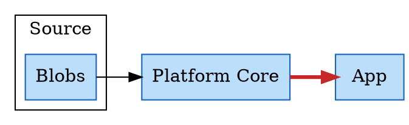

# Shabnam

**CSS on DOT diagrams.** Write Graphviz DOT for the structure, then style the result with plain CSS. The output is real HTML — divs, spans, an SVG layer — not an image.

The idea is that a diagram's *shape* and its *looks* are different jobs. DOT is good at shape and bad at looks; CSS is the opposite. So Graphviz is asked only for layout, and everything visual is a stylesheet you can read, edit and reuse.



## The one rule worth knowing

**Identity in CSS is identity in DOT.** Nothing is added and nothing is stripped:

| In the DOT | In the CSS |
|---|---|
| subgraph `cluster_a` | `.cluster_a` |
| node `lake` | `#lake` |
| edge `lake -> runtime` | `#lake_runtime` |

So whoever wrote the diagram already knows every selector they need, and there is no mapping table to fall out of date.

## Running it

Requires [Bun](https://bun.sh).

```
bun install
bun run dev     # http://localhost:3000
bun run build   # → dist/
bun test
```

## How it works

Five tabs — DOT, Base CSS, My Style, HTML, JS — over a live canvas. Press Redraw and the pipeline runs:

```
DOT → Vizer → VizJson → DiagramBagger → DiagramModel
        ├→ CssBagger    → Base CSS   (generated, editable)
        └→ LayoutFramer → HTML       → Measurer → NodeSheller (shells)
                                               → EdgeDrawer  (connectors)
```

**Base CSS is generated from the DOT.** Every colour, font and stroke the DOT asked for arrives as a CSS rule you can read and change — and only what the DOT actually said, never a default that was invented for you. **My Style** is yours and is never regenerated.

Base CSS is editable even though it is regenerated, because edits to it are rebased into My Style on Redraw. The diff runs through CSSOM — an off-document `CSSStyleSheet` is the parser — so reformatting, `RED` versus `red`, and shorthand versus longhand do not count as edits. The browser's own serialisation decides what "changed" means.

Everything is client-side: no server, no build step at runtime, no telemetry. Graphviz runs in the page via [`@viz-js/viz`](https://github.com/mdaines/viz-js). There is no DOT parser in this codebase and there is not meant to be one — `renderJSON` is the only DOT consumer.

## Features

| | |
|---|---|
| File verbs | Load/save DOT, load/save theme, export standalone HTML, export PNG |
| Shortcuts | `↵` redraw · `o`/`s` DOT · `⇧o`/`⇧s` theme · `p` PNG · `e` HTML · `1`–`5` tabs |
| Drawing | SVG shells behind the HTML, connectors with arrowheads, per-node icons and captions |
| Theming | `theme/blueprint.css` restyles everything through CSS alone |

## Reading the code

| File | What it is |
|---|---|
| `app-architecture.md` | The product contract. Start here. |
| `coding-rules.md` | House style, and the closing-ceremony routine. |
| `current-task.md` | Orientation for a new contributor, plus what is next. |
| `docs/archive.md` | How it was built, and why closed decisions were closed. |
| `docs/technical-debts.md` | Open debts, each with what closing it costs. |

## Status

Early but working, and verified in a browser against `research-lab/example-1.dot`. Known rough edges are written down rather than hidden — see `docs/technical-debts.md`. The most visible: `shape=record` renders as a box with its `|` and `{}` still showing, the `icon/` files are crude placeholder glyphs, and Base CSS emits `#id` rules that outrank anything you write in My Style.

The name is Persian for *dew* — the thin layer that makes a shape visible.
