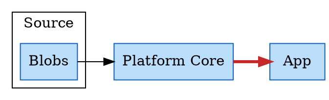

# Shabnam

**CSS on DOT diagrams.** Write Graphviz DOT for the structure, then style the result with plain CSS. The output is real HTML — divs, spans, an SVG layer — not an image.

The idea is that a diagram's *shape* and its *looks* are different jobs. DOT is good at shape and bad at looks; CSS is the opposite. So Graphviz is asked only for layout, and everything visual is a stylesheet you can read, edit and reuse.



## The one rule worth knowing

**Identity in CSS is identity in DOT.** Nothing is added and nothing is stripped:

| In the DOT | In the CSS |
|---|---|
| subgraph `cluster_a` | `.cluster_a` |
| node `lake` | `#lake` |
| edge `lake -> runtime` | `#lake_runtime` |

So whoever wrote the diagram already knows every selector they need, and there is no mapping table to fall out of date.

## Running it

Requires [Bun](https://bun.sh).

```
bun install
bun run dev     # http://localhost:3000
bun run build   # → dist/
bun test
bun run test:browser   # the CSSOM half, in real headless Chrome
```

## How it works

Four tabs — `diagram.dot` · `styles` · `annotation.html` · `action.js`. Three of them are text, painted by CodeJar. The styles tab is not: it is a table of rows. Press Redraw:

```
DOT → Vizer → VizJson → Diagram.bag → DiagramModel
        ├→ Diagram.derived → Stylist.setDerived → feed → CSSOM
        └→ Diagram.frame   → measure → clusters / shells / connectors
```

**Style is data.** A rule is `selector → property → value`, and that is the same shape on disk, in the tab, and in memory. The `Stylist` holds three layers — the shipped `theme/basic-theme.json`, the rules *derived* from your DOT attributes, and your own rows — merges them per property (later wins), and feeds the result to CSSOM. There is no CSS text on that path: no string is built to paint with and no sheet is ever parsed back.

So a row edit is one `setProperty` on a live sheet. **The picture changes as you type, with no Redraw.** Editing a theme or derived row writes a row of your own that shadows it, which is why saving only ever writes your rows, and a redraw can throw the derived layer away and rebuild it without touching anything you typed. `@apply` stays a property and is resolved at feed time.

Everything is client-side: no server, no build step at runtime, no telemetry. Graphviz runs in the page via [`@viz-js/viz`](https://github.com/mdaines/viz-js). There is no DOT parser in this codebase and there is not meant to be one — `renderJSON` is the only DOT consumer.

## Features

| | |
|---|---|
| File verbs | Load/save DOT, save styles, export standalone HTML, export PNG |
| Shortcuts | `↵` redraw · `o`/`s` DOT · `p` PNG · `e` HTML · `1`–`4` tabs |
| Drawing | SVG shells behind the HTML, connectors with arrowheads, per-node icons and captions |
| Theming | one shipped theme; rows grouped by origin; live repaint on every keystroke |

## Reading the code

| File | What it is |
|---|---|
| `app-architecture.md` | The product contract. Start here. |
| `coding-rules.md` | House style, and the closing-ceremony routine. |
| `current-task.md` | Orientation for a new contributor, plus what is next. |
| `docs/archive.md` | How it was built, and why closed decisions were closed. |
| `docs/technical-debts.md` | Open debts, each with what closing it costs. |

## Status

Early but working. Fixture: `research-lab/example-1.dot`. Open debts in `docs/technical-debts.md`. The most visible: `shape=record` still renders as a box, `icon/` files are placeholders, and derived `#id` rules outrank a class you type in the styles tab.

The name is Persian for *dew* — the thin layer that makes a shape visible.
