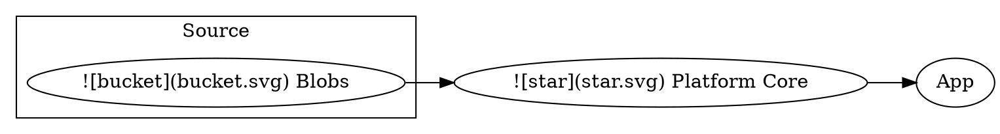

# Shabnam

**CSS on DOT diagrams.** Write Graphviz DOT for the structure, then style the result with plain CSS. The output is real HTML — divs, spans, an SVG layer — not an image.

The idea is that a diagram's *shape* and its *looks* are different jobs. DOT is good at shape and bad at looks; CSS is the opposite. A library reads the DOT and a library ranks it; everything visual after that is a stylesheet you can read, edit and reuse.


```dot
digraph starter {
  rankdir=LR

  subgraph cluster_source {
    label = "Source"
    blobs [label="![bucket](bucket.svg) Blobs" caption="Object Store"]
  }

  core [label="![star](star.svg) Platform Core"]
  app  [label="App"]

  blobs -> core
  core -> app
}
```

## The one rule worth knowing

**Identity in CSS is identity in DOT.** Nothing is added and nothing is stripped:

| In the DOT | In the CSS |
|---|---|
| subgraph `cluster_a` | `.cluster_a` |
| node `lake` | `#lake` |
| edge `lake -> runtime` | `#lake_runtime` |

So whoever wrote the diagram already knows every selector they need, and there is no mapping table to fall out of date.

## Running it

Requires [Bun](https://bun.sh).

```
bun install
bun run dev     # http://localhost:3000
bun run build   # → dist/
bun test
bun run test:browser   # the CSSOM half, in real headless Chrome
```

## How it works

Four tabs — `diagram.dot` · `styles` · `annotations` · `action.js`. Two of them are text, in one plain `<textarea>`. The other two are rows tables. Press Redraw:

```
dot ──parse──▶ Ast ──┬──▶ DiagramModel     who exists, who connects, who belongs
                     ├──▶ DotStyles        appearance, at the branch it was written
                     └──▶ PointGraph ──layout──▶ Positions

        then, after the browser paints: measure → clusters / shells / connectors → svg
```

`@ts-graphviz/ast` is the only DOT reader; `@dagrejs/dagre` is the only geometry. We never write a parser of our own.

**Style is data.** A rule is `selector → property → value`, and that is the same shape on disk, in the tab, and in memory. The `Stylist` holds **one book** of them, and every entry records who wrote it — `0` the shipped `theme/basic-theme.json`, `1` the rules read from your DOT attributes, `2` you. A repeated key is an overwrite, not a second rule, and `addRule` refuses a write whose source is lower than the entry already there. There is no merge step and no CSS text on the path: no string is built to paint with and no sheet is ever parsed back.

A row edit is one `setProperty` on a live sheet, committed on `change`, never on a keystroke. A text tab writes the store and does nothing else; the picture is as stale as the last Redraw. Editing a row writes at source `2`, and because a redraw feeds at `1`, it cannot take a row back off you. `@apply` stays a property and is expanded at feed time, against the book.

Everything is client-side: no server, no build step at runtime, no telemetry. Chromium only.

## Features

| | |
|---|---|
| File verbs | Load/save DOT, save styles, export standalone HTML, export picture (SVG or PNG) |
| Shortcuts | `↵` redraw · `o`/`s` DOT · `p` picture · `e` HTML · `1`–`4` tabs |
| Drawing | SVG shells around the HTML, connectors with arrowheads, per-node icons and captions |
| Theming | one shipped theme; rows grouped by origin; a colour row paints at once, a size row waits for Redraw |

## Reading the code

| File | What it is |
|---|---|
| `user-story.md` | What the app is, told as a story. Start here. |
| `app-architecture.md` | The product contract. |
| `coding-rules.md` | House style, and the opening/closing ceremonies. |
| `current-task.md` | What is next, and what is For Later. |
| `docs/archive.md` | How it was built, and why closed decisions were closed. |

## Status

Working. Fixture: `research-lab/example-1.dot`. `shape=record` is a split on `|` / `{}`. Icons in `icon/` are real SVGs, inlined as data URIs. Nothing in the theme styles annotations, labels or edges yet — a stated position in `app-architecture.md`, not an oversight. Wanted next is in `current-task.md`.

The name is Persian for *dew* — the thin layer that makes a shape visible.
